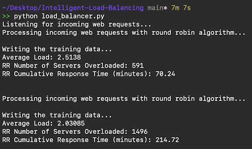
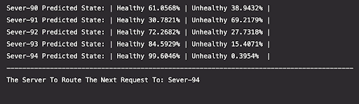

# Intelligent Load Balancing Using The Gaussian Naive Bayes Model
Towards a better algorithm for managing server loads.

Notable Features:
- Route web-traffic to 30 simulated servers in 7 regions using the Gaussian Naive Bayes model
- Reduce web server load by 12.286% when handling two batches of 10k concurrent web requests, compared to a traditional round-robin load balancing algorithm. Utilize web server resource usage reporting to formulate the training data 

**Why Gaussian Naive Bayes?**
- The data are continuous
- A strong independence is assumed between the features
- Calculating conditional probability is a requirement
- Gaussian Naive Bayes supports continuous-valued features and models each as conforming to a Gaussian (normal) distribution

&nbsp;

# Running The Simulation

Send 10k web requests (2 times) to the round robin load balancing algorithm...

---

---

The results of the round robin load balancing algorithm handling the above web traffic...

---

---

&nbsp;

## Learning From The Data Above

Out of 10k web-requests, the server-clusters reported that they were overloaded 2087 times. This makes about 20.87% of our web-requests slower, resulting in a higher cumulative response time. However, the Gaussian Naive-Bayes Model Accuracy routed 10k web-requests to non-overloaded servers about 91.416% of the time. This means that only 858 web requests experienced a slower response time as a result of server-overload.

&nbsp;

## Inspecting The Gaussian Naive-Bayes Logic

The below showcases the predicted health of all of the selected servers and how well-prepared they are to receive another web-request. All of the servers in this snippet are in Africa so a web-request coming from Africa would run through this logic to determine which server to go to next.

---

